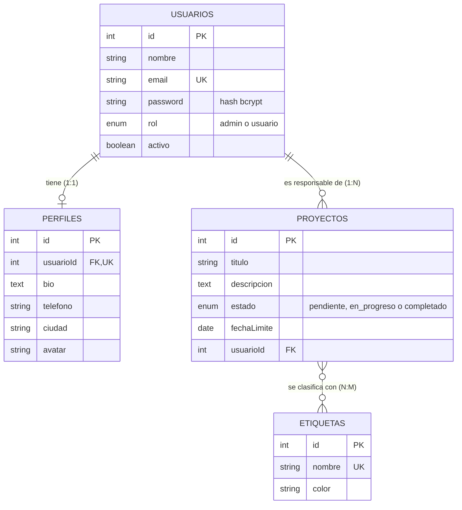
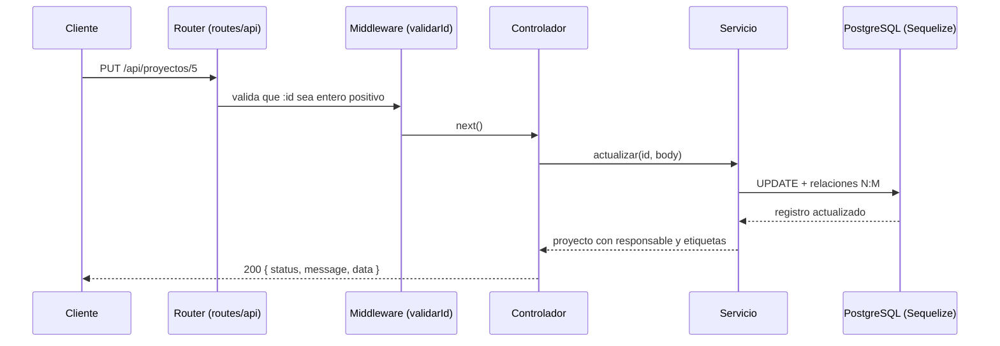

# TP Integrador Backend — Partes 1 y 2 (Módulos 6 y 7)

Aplicación web con **Node.js + Express**. La Parte 1 sirve contenido estático y dinámico y registra visitas en un archivo plano. La Parte 2 agrega **PostgreSQL con Sequelize** y una **API REST** con CRUD completo, relaciones 1:1, 1:N y N:M, filtros, búsqueda y validaciones.

> Próxima parte (3): autenticación con JWT, rutas protegidas y subida de archivos.

## Requisitos del sistema

- Node.js **v18 o superior** (probado con v22 y v24)
- npm 9+
- **PostgreSQL 14 o superior** (probado con la versión 16)
- Git

## Instalación

```bash
git clone https://github.com/mcmchechi-ship-it/tp-integrador-backend.git
cd tp-integrador-backend
npm install
```

### 1. Instalar PostgreSQL (una sola vez)

1. Descarga el instalador desde https://www.postgresql.org/download/ (Windows → *Download the installer*).
2. Durante la instalación **anota la contraseña** del usuario `postgres`, deja el puerto `5432` y deja marcado *pgAdmin* (opcional, sirve para ver las tablas).
3. Al terminar, PostgreSQL queda corriendo como servicio de Windows.

### 2. Configurar las variables de entorno

```bash
copy .env.example .env      # en Mac/Linux: cp .env.example .env
```

Abre `.env` y escribe en `DB_PASSWORD` la contraseña que definiste en el paso anterior.

### 3. Crear la base de datos y cargar datos de ejemplo

```bash
npm run db:create    # crea la base "tp_integrador" si no existe
npm run db:seed      # crea las tablas y carga datos de ejemplo
npm run dev          # inicia el servidor
```

Usuarios de ejemplo: `ana@ejemplo.com` (admin), `luis@ejemplo.com` y `sofia@ejemplo.com`, todos con la contraseña `clave12345`.

> **Sobre el aviso de `npm audit`:** al instalar aparece "2 moderate vulnerabilities". Proviene de una dependencia interna de Sequelize 6 (`uuid`) y no afecta a este proyecto porque no usa la función vulnerable. **No ejecutes `npm audit fix --force`**: propone degradar Sequelize a la versión 3, de 2016, y rompería la aplicación.

## Ejecución

| Comando | Qué hace |
|---|---|
| `npm start` | Ejecuta `node index.js` (producción) |
| `npm run dev` | Ejecuta `nodemon index.js` (reinicia al guardar cambios) |
| `npm run db:create` | Crea la base de datos indicada en `.env` (si no existe) |
| `npm run db:seed` | Carga datos de ejemplo (solo si la base está vacía) |
| `npm run db:reset` | **Borra todas las tablas**, las recrea y carga los datos de ejemplo |

Al iniciar verás `Base de datos conectada`, `Servidor iniciado` y la dirección `http://localhost:3000`. Si no puede conectarse a PostgreSQL, el servidor no arranca y explica cómo solucionarlo.

## Modelo de datos



| Relación | Tipo | Cómo se implementa |
|---|---|---|
| Usuario ↔ Perfil | 1:1 | `hasOne` / `belongsTo`; `usuarioId` es **único** en `perfiles` |
| Usuario → Proyectos | 1:N | `hasMany` / `belongsTo`; `usuarioId` en `proyectos` |
| Proyectos ↔ Etiquetas | N:M | `belongsToMany` con la tabla intermedia `proyecto_etiquetas` |

Al eliminar un usuario se eliminan en cascada su perfil y sus proyectos. Al eliminar un proyecto o una etiqueta se limpian sus filas de la tabla intermedia.

## API REST

Todas las respuestas usan el mismo formato: `{ "status": "ok" | "error", "message": "...", "data": ... }`.

### Usuarios y perfiles

| Método | Ruta | Descripción |
|---|---|---|
| GET | `/api/usuarios` | Lista paginada con filtros |
| POST | `/api/usuarios` | Crea un usuario (admite un objeto `perfil` opcional) |
| GET | `/api/usuarios/:id` | Detalle con perfil y proyectos |
| PUT | `/api/usuarios/:id` | Actualiza un usuario |
| DELETE | `/api/usuarios/:id` | Elimina un usuario (y su perfil y proyectos) |
| GET | `/api/usuarios/:id/perfil` | Obtiene el perfil |
| PUT | `/api/usuarios/:id/perfil` | Crea o actualiza el perfil |

### Proyectos

| Método | Ruta | Descripción |
|---|---|---|
| GET | `/api/proyectos` | Lista paginada con filtros |
| POST | `/api/proyectos` | Crea un proyecto (admite `etiquetas: [ids]`) |
| GET | `/api/proyectos/:id` | Detalle con responsable y etiquetas |
| PUT | `/api/proyectos/:id` | Actualiza; si se envía `etiquetas`, reemplaza el conjunto |
| DELETE | `/api/proyectos/:id` | Elimina un proyecto |

### Etiquetas

| Método | Ruta | Descripción |
|---|---|---|
| GET | `/api/etiquetas` | Lista (filtro `?q=`) |
| POST | `/api/etiquetas` | Crea una etiqueta |
| GET | `/api/etiquetas/:id` | Detalle con los proyectos que la usan |
| PUT | `/api/etiquetas/:id` | Actualiza |
| DELETE | `/api/etiquetas/:id` | Elimina |

### Filtros, búsqueda y paginación

| Parámetro | Aplica a | Ejemplo |
|---|---|---|
| `q` | usuarios, proyectos, etiquetas | `/api/usuarios?q=ana` (busca en nombre o email, sin distinguir mayúsculas) |
| `rol`, `activo` | usuarios | `/api/usuarios?rol=admin&activo=true` |
| `estado` | proyectos | `/api/proyectos?estado=pendiente` |
| `usuarioId` | proyectos | `/api/proyectos?usuarioId=1` |
| `etiqueta` | proyectos | `/api/proyectos?etiqueta=backend` (por nombre o por id) |
| `vencidos=true` | proyectos | Fecha límite pasada y no completados |
| `page`, `limit` | usuarios, proyectos | `?page=2&limit=5` (máximo 50 por página) |
| `orden` | usuarios, proyectos | `?orden=-titulo` (el `-` indica descendente) |

Los filtros se pueden combinar: `/api/proyectos?q=datos&estado=pendiente&etiqueta=urgente`.

### Ejemplo: crear un usuario con perfil

```bash
curl -X POST http://localhost:3000/api/usuarios \
  -H "Content-Type: application/json" \
  -d '{"nombre":"Marta Díaz","email":"marta@ejemplo.com","password":"secreta123","perfil":{"ciudad":"Valdivia"}}'
```

```json
{
  "status": "ok",
  "message": "Usuario creado correctamente",
  "data": { "id": 4, "nombre": "Marta Díaz", "email": "marta@ejemplo.com", "rol": "usuario", "perfil": { "ciudad": "Valdivia" } }
}
```

### Códigos de respuesta

| Código | Cuándo |
|---|---|
| 200 / 201 | Operación correcta / recurso creado |
| 400 | Datos inválidos, JSON mal formado, id o filtro incorrecto |
| 404 | El recurso o una relación (usuario, etiqueta) no existe |
| 409 | Valor duplicado (email o nombre de etiqueta repetido) |
| 500 | Error interno (se registra en `logs/log.txt`) |

Ejemplo de error de validación (`400`):

```json
{
  "status": "error",
  "message": "Datos inválidos",
  "data": [
    { "campo": "email", "mensaje": "El email no tiene un formato válido" },
    { "campo": "password", "mensaje": "La contraseña debe tener entre 8 y 72 caracteres" }
  ]
}
```

En `docs/pruebas.http` hay peticiones listas para ejecutar desde VS Code con la extensión **REST Client** (o para copiar a Postman / Thunder Client).

## Rutas de la Parte 1

| Método | Ruta | Respuesta |
|---|---|---|
| GET | `/` | HTML dinámico renderizado con EJS |
| GET | `/status` | JSON con el estado del servidor |
| GET | `/visitas` | JSON con las últimas 10 líneas de `logs/log.txt` |
| GET | `/estatico.html` | Archivo estático servido desde `/public` |

## Estructura del proyecto

```
├── index.js                 # Punto de entrada: conecta la BD y levanta el servidor
├── app.js                   # Configuración de Express (middlewares, vistas, rutas)
├── config/                  # Conexión a PostgreSQL (Sequelize)
├── models/                  # Modelos y relaciones (Usuario, Perfil, Proyecto, Etiqueta)
├── routes/                  # Rutas de la app; routes/api/ agrupa la API REST
├── controllers/             # Reciben la petición HTTP y responden
├── services/                # Lógica de negocio y acceso a datos; logger con fs
├── middlewares/             # Registro de visitas, validación de id, manejo de errores
├── utils/                   # AppError, formato de respuesta, paginación, fechas
├── scripts/                 # crear-bd.js y seed.js
├── views/                   # Plantillas EJS
├── public/                  # Archivos estáticos (CSS, HTML)
├── logs/                    # log.txt (archivo plano generado en ejecución)
└── docs/                    # Reflexiones, evidencias y pruebas de la API
```

## Flujo de una petición a la API



Si algo falla en el servicio (validación, duplicado, no encontrado), el error viaja hasta el middleware de errores, que lo convierte en una respuesta con el código HTTP correspondiente.

## Decisiones técnicas y justificaciones

### Parte 1

- **Archivo principal `index.js`:** es la convención por defecto de npm (`"main"`) y permite ejecutar `node index.js` y `npm start` sin configuración extra. Se separó de `app.js`, que contiene solo la configuración de Express, para poder probar la aplicación sin abrir un puerto y para que el arranque (incluida la conexión a la base de datos) quede en un único lugar.
- **Scripts:** se mantuvieron los nombres estándar `start` y `dev`, que cualquier desarrollador Node reconoce sin leer documentación.
- **Estructura de carpetas:** además de `routes`, `controllers`, `middlewares`, `public` y `logs`, se agregaron `services`, `utils` y `views` (motor de plantillas), y en la Parte 2 `models`, `config` y `scripts`.
- **Uso de `/public` y de EJS:** se usan ambos. `/public` sirve el CSS y `estatico.html`; `/` usa EJS porque muestra contenido dinámico.
- **Eventos del log:** además de las visitas (`VISITA`) se registran el inicio del servidor (`INICIO_SERVIDOR`) y los errores (`ERROR_404`, `ERROR_500`, `ERROR_BD`). Cada línea se valida con una expresión regular (fecha, hora y evento) antes de escribirse con `fs.appendFile`, que es asíncrono y no bloquea el servidor.
- **Formato `{ status, message, data }`:** se usa en todas las respuestas JSON, incluidos los errores.

### Parte 2

Detalle completo en [`docs/REFLEXIONES-parte2.md`](docs/REFLEXIONES-parte2.md). Las más relevantes:

- **PostgreSQL + Sequelize 6:** base relacional adecuada para modelar las tres relaciones pedidas (1:1, 1:N y N:M) con integridad referencial. Se usa la v6 estable.
- **Capas separadas:** rutas → controladores → servicios → modelos. Los controladores no conocen la base de datos, lo que facilita agregar JWT en la Parte 3.
- **Contraseñas con bcrypt (`bcryptjs`):** nunca se guardan ni se devuelven en texto plano; el modelo las excluye por defecto de las consultas.
- **Validación en dos niveles:** validadores del modelo (formato, largo, valores permitidos) y validaciones del servicio (existencia de usuario y etiquetas, filtros de la URL).
- **Lista blanca de campos:** solo se aceptan los campos previstos, para evitar que el cliente modifique `id` o fechas. Además, **`rol` no se acepta al crear un usuario**, para que nadie pueda registrarse como administrador.
- **Errores centralizados:** un solo middleware traduce errores de Sequelize a 400, 404 o 409.
- **`sequelize.sync()` en lugar de migraciones:** simple y suficiente para este proyecto; en producción se usarían migraciones.

## Evidencias

- `docs/evidencia-*.txt` y `docs/log-ejemplo.txt`: evidencias de la Parte 1.
- Reflexiones técnicas: [`docs/REFLEXIONES.md`](docs/REFLEXIONES.md) (Parte 1) y [`docs/REFLEXIONES-parte2.md`](docs/REFLEXIONES-parte2.md) (Parte 2).
