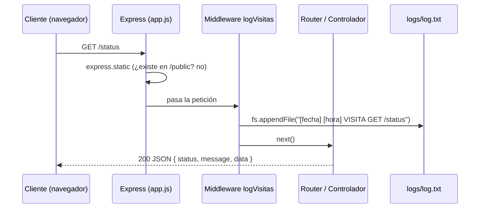

# TP Integrador Backend — Parte 1 (Módulo 6)

Servidor web con **Node.js + Express** que sirve contenido estático y dinámico, expone rutas públicas y registra visitas en un archivo plano. Es la base sobre la que se integrarán base de datos, ORM y API con JWT en las Partes 2 y 3.

## Requisitos del sistema

- Node.js **v18 o superior** (probado con v22)
- npm 9+
- Git

## Instalación

```bash
git clone https://github.com/mcmchechi-ship-it/tp-integrador-backend.git
cd tp-integrador-backend
npm install
cp .env.example .env      # en Windows: copy .env.example .env
```

## Ejecución

| Comando | Qué hace |
|---|---|
| `npm start` | Ejecuta `node index.js` (producción) |
| `npm run dev` | Ejecuta `nodemon index.js` (reinicia al guardar cambios) |

Al iniciar verás `Servidor iniciado` en la terminal. Por defecto queda en `http://localhost:3000` (configurable con `PORT` en `.env`).

## Ejemplos de uso

| Método | Ruta | Respuesta |
|---|---|---|
| GET | `/` | HTML dinámico renderizado con EJS |
| GET | `/status` | JSON con el estado del servidor |
| GET | `/visitas` | JSON con las últimas 10 líneas de `logs/log.txt` |
| GET | `/estatico.html` | Archivo estático servido desde `/public` |

```bash
curl http://localhost:3000/status
# {"status":"ok","message":"Servidor funcionando correctamente","data":{"uptimeSegundos":2,"nodeVersion":"v22.22.2","fecha":"..."}}
```

Cualquier ruta inexistente responde `404` con el mismo formato `{ status, message, data }`.

## Estructura del proyecto

```
├── index.js                 # Punto de entrada: carga .env y levanta el servidor
├── app.js                   # Configuración de Express (middlewares, vistas, rutas)
├── routes/                  # Definición de rutas (router externo con app.use)
├── controllers/             # Lógica de cada ruta
├── middlewares/             # Registro de visitas y manejo de errores
├── services/                # Lógica reutilizable (logger con fs)
├── utils/                   # Funciones auxiliares (formato de fecha)
├── views/                   # Plantillas EJS
├── public/                  # Archivos estáticos (CSS, HTML)
├── logs/                    # log.txt (archivo plano generado en ejecución)
└── docs/                    # Evidencias y reflexiones técnicas
```

## Flujo cliente–servidor



## Decisiones técnicas y justificaciones

- **Archivo principal `index.js`:** es la convención por defecto de npm (`"main"`), permite ejecutar `node index.js` y `npm start` sin configuración extra. Se separó de `app.js`, que contiene solo la configuración de Express, para poder testear la app sin abrir un puerto y para que el arranque quede en un único lugar cuando se agregue la conexión a la base de datos en la Parte 2.
- **Scripts:** se mantuvieron los nombres estándar `start` y `dev`, que cualquier desarrollador Node reconoce sin leer documentación.
- **Estructura con carpetas adicionales:** además de `routes`, `controllers`, `middlewares`, `public` y `logs`, se agregaron `services` (la consigna pide esta capa en la arquitectura final y aquí aloja el logger), `utils` y `views` (motor de plantillas).
- **Uso de `/public` y de EJS:** se usan ambos. `/public` sirve el CSS y `estatico.html`; `/` usa EJS (tarea PLUS) porque muestra contenido dinámico (fecha y tabla de rutas generadas desde un arreglo).
- **Eventos registrados en el log:** además de las visitas a rutas (`VISITA`), se registran el inicio del servidor (`INICIO_SERVIDOR`) y los errores (`ERROR_404`, `ERROR_500`). Son útiles para diagnosticar y no agregan complejidad.
- **Validación del log:** `esLineaValida()` comprueba con una expresión regular que cada línea tenga fecha, hora y evento/ruta antes de escribirla.
- **`fs.appendFile` asíncrono:** no bloquea el event loop al atender peticiones.
- **Formato de respuesta `{ status, message, data }`:** se adopta desde ahora en las rutas JSON para mantener consistencia con la API de la Parte 3.
- **Manejo de errores centralizado:** un middleware de 404 y otro de 500 evitan repetir `try/catch` con respuestas distintas en cada controlador.

## Evidencias

En `docs/` se incluyen la salida del servidor (`evidencia-servidor.txt`), las respuestas de cada ruta (`evidencia-rutas.txt`) y un `log-ejemplo.txt` con los registros generados. Reflexiones técnicas en [`docs/REFLEXIONES.md`](docs/REFLEXIONES.md).
